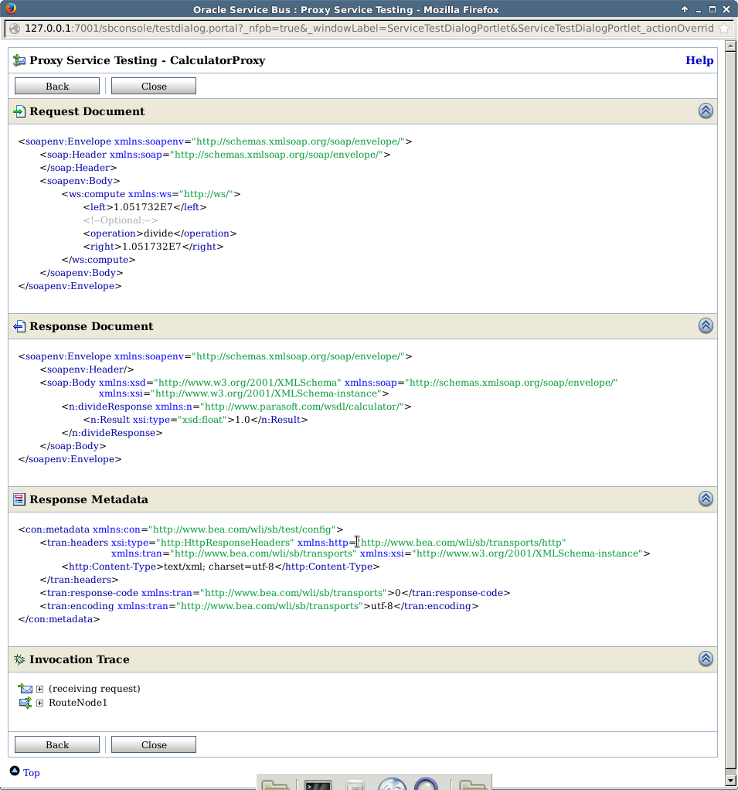

Homework 5: OSB - Transformation
================================

### Routing screenshots:

### Requests screenshots

#### Add computation

#### Subtract computation

#### Multiply computation

#### Divide computation

